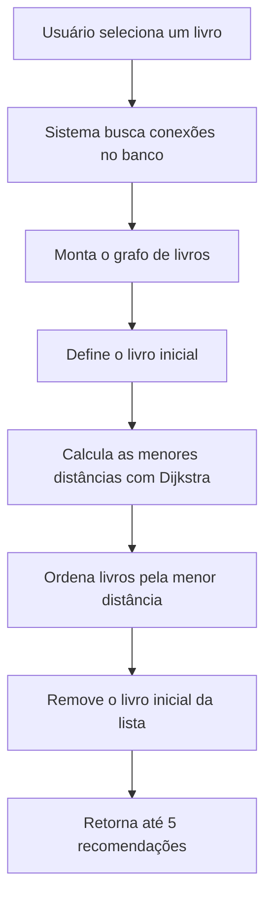
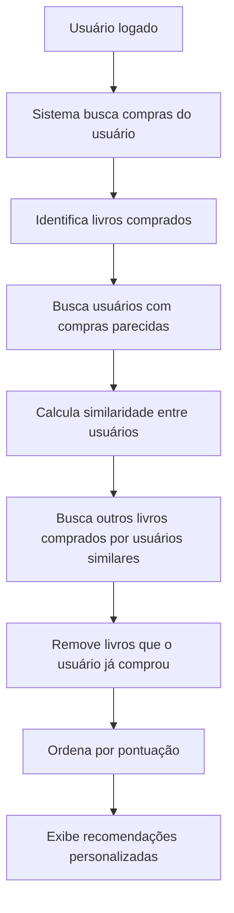

# Book-Nodes — Sistema de Recomendação de Livros com Grafos

<p align="center">
  
  
  
  
  
</p>

<p align="center">
  Sistema web de recomendação de livros baseado em Teoria dos Grafos, utilizando o algoritmo de Dijkstra para sugerir livros semelhantes.
</p>

---

## Sobre o Projeto

O **Book-Nodes** é um sistema web desenvolvido com **Python**, **Flask**, **SQLite** e **NetworkX**, criado para recomendar livros com base em relações de similaridade entre obras.

O projeto utiliza conceitos de **Teoria dos Grafos**, onde cada livro é representado como um nó e as conexões entre livros são representadas como arestas ponderadas.

A partir dessas conexões, o sistema aplica o algoritmo de **Dijkstra** para encontrar livros próximos ao livro selecionado pelo usuário, retornando recomendações com base na menor distância entre os nós do grafo.

Além da recomendação por similaridade entre livros, o sistema também possui recomendação baseada no comportamento de usuários, considerando compras realizadas e usuários com interesses semelhantes.

---

## Descrição Curta

Sistema de recomendação de livros para e-commerce, desenvolvido com Flask, SQLite e Teoria dos Grafos, utilizando o algoritmo de Dijkstra para recomendar livros semelhantes a partir de conexões ponderadas.

---

## Objetivo do Projeto

O objetivo do **Book-Nodes** é desenvolver um sistema capaz de recomendar livros semelhantes com base em relações de similaridade, utilizando grafos ponderados e o algoritmo de Dijkstra para calcular caminhos de menor custo.

Com esse projeto, é possível praticar:

- desenvolvimento web com Flask;
- modelagem de banco de dados com SQLite;
- uso de SQLAlchemy;
- autenticação de usuários com Flask-Login;
- cadastro, login e logout;
- recuperação de senha com token;
- criação de carrinho de compras;
- registro de compras;
- aplicação de Teoria dos Grafos;
- implementação do algoritmo de Dijkstra;
- recomendação de livros por similaridade;
- recomendação baseada em comportamento de usuários;
- visualização de grafos com NetworkX e Matplotlib;
- testes automatizados com Pytest.

---

## Funcionalidades

- Cadastro de usuários.
- Login de usuários.
- Logout.
- Recuperação de senha.
- Redefinição de senha com token.
- Listagem de livros.
- Exibição de detalhes do livro.
- Carrinho de compras.
- Adição de livros ao carrinho.
- Remoção de itens do carrinho.
- Registro de compras.
- Perfil do usuário.
- Recomendação de livros com Dijkstra.
- Recomendação personalizada por usuário.
- Visualização gráfica das recomendações.
- Visualização de relações entre usuários e livros.
- Banco de dados SQLite.
- Dados iniciais gerados por script.
- Testes automatizados para o algoritmo de recomendação.

---

## Tecnologias Utilizadas

| Tecnologia | Finalidade |
|---|---|
| Python | Linguagem principal do projeto |
| Flask | Framework web |
| Flask-Login | Controle de autenticação e sessão |
| Flask-SQLAlchemy | ORM para integração com banco de dados |
| SQLite | Banco de dados local |
| NetworkX | Criação e manipulação de grafos |
| Matplotlib | Geração de visualizações dos grafos |
| Requests | Requisições HTTP |
| Pytest | Testes automatizados |
| HTML5 | Estrutura das páginas |
| CSS3 | Estilização das telas |
| Bootstrap | Apoio visual na interface |
| CSV | Importação de conexões entre livros |

---

## Estrutura do Projeto

```text
Book-Nodes/
│
├── data/
│   ├── database.db
│   ├── grafo_conexoes.csv
│   └── testdata.py
│
├── docs/
│   ├── E1_Grupo15_Documento de Visão (1).md
│   ├── E2_Grupo15_Designer_técnico.md
│   ├── E3_Book-Nodes.md
│   ├── README.md
│   │
│   └── img/
│       ├── Carrinho.png
│       ├── Home.png
│       ├── Perfil.png
│       ├── cadastrar.png
│       ├── diagrama1.jpeg
│       ├── diagramaarquitetura.jpeg
│       ├── login.png
│       ├── logo.png
│       └── recuperar.png
│
├── src/
│   ├── app.py
│   ├── atualizar_capas.py
│   ├── engine.py
│   ├── models.py
│   ├── visualizacao_dijkstra.py
│   ├── visualizacao_usuario.py
│   │
│   ├── static/
│   │   ├── img/
│   │   │   └── sem-capa.png
│   │   │
│   │   └── Logo/
│   │       └── img/
│   │           └── logo-book-nodes.png
│   │
│   └── templates/
│       ├── algoritmo_usuario.html
│       ├── base.html
│       ├── carrinho.html
│       ├── detalhe.html
│       ├── esqueci_senha.html
│       ├── index.html
│       ├── link_redefinicao.html
│       ├── login.html
│       ├── perfil.html
│       └── redefinir_senha.html
│
├── tests/
│   └── test_engine.py
│
├── .gitignore
├── LICENSE
├── database_manager.py
├── requirements.txt
├── seed.py
└── README.md
```

---

## Descrição dos Principais Arquivos

### `src/app.py`

Arquivo principal da aplicação Flask.

Ele contém as rotas responsáveis por:

- exibir a página inicial;
- realizar login;
- realizar cadastro;
- fazer logout;
- recuperar senha;
- redefinir senha;
- exibir detalhes dos livros;
- adicionar itens ao carrinho;
- remover itens do carrinho;
- finalizar compras;
- exibir perfil do usuário;
- gerar recomendações;
- renderizar visualizações dos grafos.

---

### `src/models.py`

Arquivo responsável pelos modelos do banco de dados.

Ele contém as classes:

- `Usuario`;
- `Livro`;
- `Compra`;
- `Carrinho`;
- `Conexao`;
- `UsuarioLivro`.

Essas classes representam as tabelas usadas no SQLite.

---

### `src/engine.py`

Arquivo responsável pela lógica principal de recomendação.

Nele estão implementadas duas funções principais:

```python
obter_recomendacoes(livro_id_inicial)
```

Essa função recomenda livros semelhantes a partir de um livro selecionado, utilizando o algoritmo de Dijkstra.

```python
obter_recomendacoes_por_usuario(usuario_id, limite=5)
```

Essa função recomenda livros com base em compras de usuários parecidos.

---

### `src/visualizacao_dijkstra.py`

Arquivo responsável por gerar uma visualização gráfica do grafo de livros.

Ele utiliza **NetworkX** e **Matplotlib** para montar o grafo e destacar:

- livro inicial;
- livros recomendados;
- caminhos encontrados;
- conexões relevantes.

---

### `src/visualizacao_usuario.py`

Arquivo responsável por gerar uma visualização gráfica baseada no usuário.

Ele representa relações entre:

- usuário atual;
- livros comprados;
- usuários semelhantes;
- livros recomendados.

---

### `database_manager.py`

Arquivo auxiliar para gerenciamento do banco de dados.

Ele permite:

- criar tabelas sem apagar os dados existentes;
- criar usuários de teste;
- listar usuários cadastrados;
- importar conexões entre livros a partir de CSV.

---

### `seed.py`

Script responsável por popular o banco de dados com dados iniciais.

Ele cria:

- usuário administrador;
- livros;
- autores;
- categorias;
- conexões entre livros.

---

### `requirements.txt`

Arquivo com as dependências necessárias para executar o projeto.

Dependências principais:

```text
flask
flask-login
flask-sqlalchemy
networkx
matplotlib
requests
pytest
```

---

### `tests/test_engine.py`

Arquivo com testes automatizados para o algoritmo de recomendação.

Os testes validam cenários como:

- caso base do Dijkstra;
- grafo vazio;
- grafo completo;
- limite de cinco recomendações;
- recomendação baseada em usuários.

---

## Banco de Dados

O projeto utiliza **SQLite** como banco de dados local.

O arquivo do banco fica em:

```text
data/database.db
```

---

## Principais Tabelas

### `Usuario`

Responsável por armazenar os usuários cadastrados.

| Campo | Descrição |
|---|---|
| `id` | Identificador único do usuário |
| `nome` | Nome do usuário |
| `email` | E-mail do usuário |
| `senha` | Senha criptografada |

---

### `Livro`

Responsável por armazenar os livros disponíveis no sistema.

| Campo | Descrição |
|---|---|
| `id` | Identificador único do livro |
| `titulo` | Título do livro |
| `autor` | Autor do livro |
| `categoria` | Categoria ou gênero |
| `resumo` | Resumo do livro |
| `foto_url` | URL ou caminho da capa |
| `preco` | Preço do livro |

---

### `Conexao`

Responsável por armazenar as conexões entre livros.

Cada conexão representa uma relação entre dois livros.

| Campo | Descrição |
|---|---|
| `id` | Identificador da conexão |
| `livro_id_1` | Primeiro livro conectado |
| `livro_id_2` | Segundo livro conectado |
| `peso` | Peso da conexão |

Quanto menor o peso, maior a proximidade entre os livros no grafo.

---

### `Carrinho`

Responsável por armazenar os itens adicionados ao carrinho.

| Campo | Descrição |
|---|---|
| `id` | Identificador do item |
| `usuario_id` | Usuário dono do carrinho |
| `livro_id` | Livro adicionado ao carrinho |
| `quantidade` | Quantidade do item |

---

### `Compra`

Responsável por armazenar as compras realizadas.

| Campo | Descrição |
|---|---|
| `id` | Identificador da compra |
| `usuario_id` | Usuário que realizou a compra |
| `livro_id` | Livro comprado |
| `data_compra` | Data e hora da compra |

---

### `UsuarioLivro`

Responsável por armazenar interações entre usuários e livros.

| Campo | Descrição |
|---|---|
| `id` | Identificador da interação |
| `usuario_id` | ID do usuário |
| `livro_id` | ID do livro |
| `peso` | Peso da interação |
| `tipo_interacao` | Tipo de interação, como compra |

---

## Algoritmo de Recomendação

O projeto utiliza o algoritmo de **Dijkstra** para recomendar livros com base na menor distância entre nós de um grafo.

No contexto do Book-Nodes:

- cada livro é um nó;
- cada conexão entre livros é uma aresta;
- cada aresta possui um peso;
- o algoritmo encontra os livros mais próximos do livro selecionado;
- os livros com menor distância são recomendados ao usuário.

---

## Fluxo do Algoritmo de Dijkstra



---

## Recomendação por Usuário

Além da recomendação por livro, o sistema também recomenda livros com base em usuários semelhantes.

O fluxo funciona assim:

1. O sistema identifica os livros comprados pelo usuário atual.
2. Busca outros usuários que compraram livros iguais.
3. Calcula uma pontuação de similaridade entre os usuários.
4. Analisa outras compras desses usuários parecidos.
5. Recomenda livros ainda não comprados pelo usuário atual.

---

## Fluxo da Recomendação por Usuário



---

## Como Executar o Projeto

### 1. Clone o repositório

```bash
git clone https://github.com/MacQueenDev/Book-Nodes.git
```

---

### 2. Acesse a pasta do projeto

```bash
cd Book-Nodes
```

---

### 3. Crie um ambiente virtual

No Windows:

```bash
python -m venv venv
venv\Scripts\activate
```

No Linux ou macOS:

```bash
python3 -m venv venv
source venv/bin/activate
```

---

### 4. Instale as dependências

```bash
pip install -r requirements.txt
```

Caso alguma dependência falte, instale manualmente:

```bash
pip install flask flask-login flask-sqlalchemy networkx matplotlib requests pytest
```

---

### 5. Popule o banco de dados

```bash
python seed.py
```

---

### 6. Verifique ou crie as tabelas do banco

```bash
python database_manager.py
```

---

### 7. Atualize as capas dos livros

```bash
python src/atualizar_capas.py
```

Essa etapa é opcional, mas ajuda a preencher imagens dos livros.

---

### 8. Execute a aplicação

```bash
python src/app.py
```

---

### 9. Acesse no navegador

Abra o navegador e acesse:

```text
http://127.0.0.1:5000
```

---

## Usuário de Teste

O script `seed.py` cria um usuário administrador para teste:

```text
E-mail: admin@email.com
Senha: 123
```

---

## Rotas da Aplicação

| Rota | Descrição |
|---|---|
| `/` | Página inicial com catálogo de livros |
| `/login` | Tela de login |
| `/cadastro` | Tela de cadastro |
| `/logout` | Encerra a sessão do usuário |
| `/perfil` | Exibe o perfil do usuário |
| `/carrinho` | Exibe o carrinho de compras |
| `/esqueci-senha` | Tela de recuperação de senha |
| `/redefinir-senha/<token>` | Tela de redefinição de senha |
| `/detalhe/<id>` | Exibe detalhes de um livro |
| `/algoritmo-usuario` | Exibe recomendações por usuário |

---

## Como Usar o Sistema

1. Acesse a aplicação no navegador.
2. Faça login com o usuário de teste ou crie uma nova conta.
3. Navegue pelo catálogo de livros.
4. Clique em um livro para visualizar detalhes.
5. Veja recomendações semelhantes baseadas no grafo.
6. Adicione livros ao carrinho.
7. Finalize a compra.
8. Acesse o perfil para visualizar informações do usuário.
9. Consulte recomendações personalizadas baseadas nas compras.

---

## Testes Automatizados

O projeto possui testes automatizados com **Pytest**.

Para executar os testes, use:

```bash
pytest
```

Ou execute diretamente:

```bash
pytest tests/test_engine.py
```

Os testes verificam principalmente o funcionamento do algoritmo de recomendação em diferentes cenários.

---

## Documentação do Projeto

A pasta `docs/` contém documentos acadêmicos e técnicos do projeto:

| Arquivo | Descrição |
|---|---|
| `E1_Grupo15_Documento de Visão (1).md` | Documento de visão do projeto |
| `E2_Grupo15_Designer_técnico.md` | Documento de design técnico |
| `E3_Book-Nodes.md` | Documento do MVP |
| `docs/README.md` | README complementar/documentação interna |

---

## Exemplo de Uso

Um usuário acessa o **Book-Nodes**, faz login e escolhe um livro do catálogo, como uma obra de fantasia.

O sistema identifica esse livro como nó inicial no grafo, analisa suas conexões com outros livros e calcula as menores distâncias usando Dijkstra.

Depois disso, o sistema recomenda livros próximos, considerando pesos de similaridade, categoria, autor e conexões cadastradas.

Além disso, se o usuário já tiver realizado compras, o sistema também pode recomendar livros comprados por usuários com comportamento semelhante.

---

## Possíveis Melhorias Futuras

Algumas melhorias que podem ser implementadas futuramente:

- Melhorar a interface visual do catálogo.
- Criar painel administrativo para cadastro de livros.
- Permitir edição e exclusão de livros.
- Permitir avaliação de livros pelos usuários.
- Criar sistema de favoritos.
- Criar filtros por categoria, autor e preço.
- Criar busca por título.
- Melhorar a tela de recomendações.
- Criar página específica para visualização do grafo.
- Adicionar paginação no catálogo.
- Melhorar segurança da chave secreta.
- Usar variáveis de ambiente.
- Criar envio real de e-mail para recuperação de senha.
- Criar testes para rotas Flask.
- Criar testes para autenticação.
- Melhorar cobertura dos testes.
- Publicar o projeto em ambiente online.

---

## Pontos de Atenção

- A chave secreta da aplicação está definida diretamente no código.
- Em ambiente real, o ideal é usar variável de ambiente.
- O banco de dados usado é SQLite, indicado para estudo e projetos pequenos.
- O link de recuperação de senha é exibido na aplicação/terminal, não enviado por e-mail real.
- A atualização de capas depende de conexão com a internet.
- O projeto possui foco acadêmico e pode ser expandido futuramente.

---

## Sugestão de Variável de Ambiente

Para melhorar a segurança, futuramente a chave secreta pode ser configurada em um arquivo `.env`.

Exemplo:

```env
SECRET_KEY=sua_chave_secreta_aqui
```

E no código:

```python
import os

app.config["SECRET_KEY"] = os.getenv("SECRET_KEY")
```

---

## Autores

Projeto desenvolvido em grupo por:

- [Matheus Silva Soares](https://github.com/mthxssoares)
- [Marcos Antônio Da Silva Souza](https://github.com/MacQueenDev)
- [Gabriel Alves Dias Reis](https://github.com/gabe-herrera)

Projeto desenvolvido para fins acadêmicos e de aprendizado, com foco em desenvolvimento web, Python, Flask, banco de dados, autenticação de usuários, carrinho de compras, Teoria dos Grafos, algoritmo de Dijkstra, sistema de recomendação e testes automatizados.

---

## Informações Acadêmicas

| Campo | Informação |
|---|---|
| Universidade | Universidade Braz Cubas |
| Curso | Ciência da Computação |
| Disciplina | Teoria dos Grafos |
| Projeto | Sistema de Recomendação de Livros baseado em Grafos de Similaridade |
| Período | Noturno |

---

## Licença

Este projeto está sob a licença MIT.

Sinta-se à vontade para utilizar, estudar e adaptar este projeto para fins acadêmicos e educacionais.
